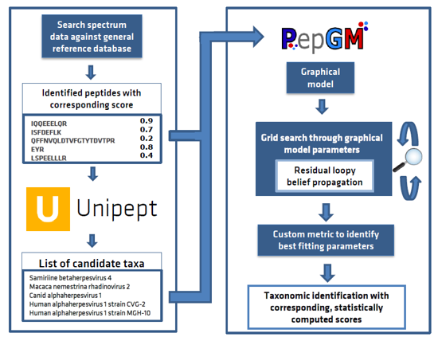

<!-- PROJECT SHIELDS -->
<!--
*** I'm using markdown "reference style" links for readability.
*** Reference links are enclosed in brackets [ ] instead of parentheses ( ).
*** See the bottom of this document for the declaration of the reference variables
*** for contributors-url, forks-url, etc. This is an optional, concise syntax you may use.
*** https://www.markdownguide.org/basic-syntax/#reference-style-links
-->
<!-- PROJECT LOGO -->
 

  

<h3 align="center">The Peptonizer 2000</h3>

  

    Integrating PepGM and Unipept for probability-based taxonomic inference of metaproteomic samples
     
  

<!-- TABLE OF CONTENTS -->

  
Table of Contents

  <ol>
    <li>
      <a href="#about-the-project">About The Project</a>
      <ul>
      </ul>
    </li>
    <li><a href="#input">Input</a></li>
    <li>
      <a href="#getting-started">Getting Started</a>
      <ul>
        <li><a href="#prerequisites">Prerequisites</a></li>
        <li><a href="#installation">Installation</a></li>
        <li><a href="#preparation">Preparation</a></li>
      </ul>
    </li>
    <li><a href="#usage">Usage</a></li>
    <li><a href="#roadmap">Roadmap</a></li>
    <li><a href="#contributing">Contributing</a></li>
    <li><a href="#license">License</a></li>
    <li><a href="#contact">Contact</a></li>
  </ol>

<!-- ABOUT THE PROJECT -->
## About The Project

Introducing the Peptonizer2000 - a tool that combines the capabilities of Unipept and PepGM to analyze
metaproteomic mass spectrometry-based samples. Originally designed for taxonomic inference of viral
mass spectrometry-based samples, we've extended PepGM's functionality to analyze metaproteomic samples by
retrieving taxonomic information from the Unipept database.

PepGM is a probabilistic graphical model developed by the eScience group at BAM (Federal Institute for Materials
Research and Testing) that uses belief propagation to infer the taxonomic origin of peptides and taxa in viral samples.
You can learn more about PepGM on our eScience group at BAM (Federal Institute for Materials Research and Testing).
Please refer to our [GitHub](https://github.com/BAMeScience/PepGM) page.

Unipept, on the other hand, is a web-based metaproteomics analysis tool that provides taxonomic information for
identified peptides. To make it work seamlessly with PepGM, we've extended Unipept with new functionalities that
restrict the taxa queried and provide all potential taxonomic origins of the peptides queried. Check out more
information about Unipept [here](https://unipept.ugent.be/).

With the Peptonizer2000, you can look forward to a comprehensive and streamlined workflow that simplifies
the process of identifying peptides and their taxonomic origins in metaproteomic samples.

The Peptonizer2000 workflow is comprised of the following steps:

1. Start by conducting a database search using X!Tandem and [MS2Rescore](https://github.com/compomics/ms2rescore).
   The reference database has to be provided by the user.
2. Query all identified peptides in the Unipept API,
   and restrict the taxonomic range queried based on any prior knowledge of the sample.
3. Assemble the peptide-taxon associations provided by Unipept into a bipartite graph,
   where peptides and taxa are represented by different nodes, and an edge is drawn between a peptide and a taxon
   if the peptide is part of the taxon's proteome.
4. Transform the bipartite graph into a factor graph using convolution trees and conditional probability table
   factors (CPD).
5. Run the belief propagation algorithm multiple times with different sets of CPD parameters until convergence,
   to obtain posterior probabilities of candidate taxa.
6. Use an empirically deduced metric to determine the ideal graph parameter set.
7. Output the top 15 scoring taxa as a results barchart. The results are also available as comma-separated files
   for further downstream analysis or visualizations.

    

 

(<a href="#top">back to top</a>)

<!-- INPUT -->

## Input

* Your raw spectrum file in mgf format
* A reference database in fasta format  

(<a href="#top">back to top</a>)

<!-- GETTING STARTED -->
## Getting Started

### Prerequisites

Install PepGM. Find installation instructions [here](https://github.com/BAMeScience/PepGM).

### Configuration file

Peptonizer2000 relies on a configuration file in `yaml` format to set up the workflow.
An example configuration file is provided in `config/config.yaml`.  
Do not change the config file location.

 
   
 
 PepGM parameter 

   <ul>
      <li> DataDir:  Relative path to raw spectra </li>
      <li> DatabaseDir: Relative path to database </li>
      <li> ResultsDir: Relative path to results </li>
      <li> ResourcesDir: Relative path to resources </li> 
      <li> ExperimentName: Name of subfolder in results </li>
      <li>TaxaInPlot: # of inferred taxa that appear in the barplot that is created of the results csv</li>
      <li>Alpha: Grid search increments for alpha </li>
      <li>Beta: Grid search increments for beta </li>
      <li>prior: grid search increments for prior </li>
   </ul>
   

   
 
 Sample specific parameter 

   <ul>
      <li> SpectraFileType: mgf or mzML </li>
      <li> SampleName: wildcard for spectra file and folder name </li>
      <li> ReferenceDBName: wildvard for reference database name </li>
   </ul>
   

   
 
 X!Tandem parameter 

   <ul>
       <li>search_engine: Search engine name </li>
       <li>xtandem_default: # Absolute X!Tandem default configuration file path </li>
       <li>xtandem_fmme: Fragment mass tolerance (default=0.4) </li>
       <li>xtandem_fmmeu: ragment mass tolerance unit (default="DA")</li>
       <li>xtandem_pmmep: Precursor mass tolerance plus (default=100) </li>
       <li>xtandem_pmmem: Precursor mass tolerance minus (default=100)</li>
       <li>xtandem_pmmeu: Precursor mass tolerance unit (default="ppm") </li>
       <li>xtandem_mods_fixed: Fixed modifications, comma separated (default="57@C")</li>
       <li>xtandem_mods_variable: Variable modifications, e.g. "16@M", comma separated (default=None)</li>
       <li>xtandem_mods_variable_nterm: Variable N-terminal modifications, e.g."+42.0@[", comma separated (default=None)</li>
       <li>xtandem_add_params: Additional parameters for X!Tandem as json dictionary{"param1" : "value", "param2" : "value", ...} which will be added to thextandem_input.xml</li>
   </ul>
   

   
 
 MS2Rescore parameter 

   <ul>
       <li>RescorePipeline: Pipeline to use,
      any of ['infer', 'pin', 'tandem', 'maxquant', 'msgfplus', 'peptideshaker']. Default: ['infer'] </li>
       <li>RescoreFeatures: Feature sets for which to generate PIN files, 
      any of ["searchengine", "ms2pip", "rt"]. Default:  ['searchengine', 'rt', 'ms2pip'].</li>
       <li>RunPercolator:  Run Percolator within MS²Rescore. Default: False. </li>
       <li>FragModel: MS2PIP model to use. Default: 'HCD' </li>
       <li>Mods: Array of peptide mass modifications. Refer to #/definitions/modifications 
      <a href="https://github.com/compomics/ms2rescore/blob/master/configuration.md">here</a>. </li>
   </ul>
   Please check the official 
   <a href="http://compomics.github.io/projects/ms2rescore#configuration-file">MS2Rescore documentation</a>
   for more details.

   

   
 
 UniPept parameter 

   <ul>
       <li>TaxaNumber: # of taxa </li>
       <li>targetTaxa: Comma separated list of taxa compromises the UniPept query</li>
       <li>FDR: FDR level, decimal</li>
   </ul> 
   

### Output files

All Peptonizer2000 output files are saved into the results folder and include the following:  

Main results:  

- PepGM_Results.csv: Table with values ID, score, type (contains all taxids under 'ID' and all probabilities under '
  score' tosterior probabilities of n (default: 15) highest scoring taxa  
   

Additional (intermediate):  
- Intermediate results folder sorted by their prior value for all possible grid search parameter combinations
- mapped_taxids_weights.csv: csv file of all taxids that had at least one protein map to them and their weight 
- PepGM_graph.graphml: graphml file of the graphical model (without convolution tree factors). Useful to visualize the graph structure and peptide-taxon connections  
- paramcheck.png: barplot of the metric used to determine the graphical model parameters for n (default: 15) best performing parameter combinations  
- log files for bug fixing

(<a href="#top">back to top</a>)

<!-- LICENSE -->
## License

Distributed under the MIT License. See `LICENSE.txt` for more information.

(<a href="#top">back to top</a>)

<!-- CONTACT -->
## Contact

Tanja Holstein - [@HolsteinTanja](https://twitter.com/HolsteinTanja) - tanja.holstein@bam.de  
Franziska Kistner - [LinkedIn](https://www.linkedin.com/in/franziska-kistner-58a57b18b) - franziska.kistner@bam.de  
Pieter Verschaffelt - pieter.verschaffelt@ugent.be

(<a href="#top">back to top</a>)

<!-- MARKDOWN LINKS & IMAGES -->
<!-- https://www.markdownguide.org/basic-syntax/#reference-style-links -->
[contributors-shield]: https://img.shields.io/github/contributors/BAMeScience/repo_name.svg?style=for-the-badge
[contributors-url]: https://github.com/BAMeScience/repo_name/graphs/contributors
[forks-shield]: https://img.shields.io/github/forks/BAMeScience/repo_name.svg?style=for-the-badge
[forks-url]: https://github.com/BAMeScience/repo_name/network/members
[stars-shield]: https://img.shields.io/github/stars/BAMeScience/repo_name.svg?style=for-the-badge
[stars-url]: https://github.com/BAMeScience/repo_name/stargazers
[issues-shield]: https://img.shields.io/github/issues/BAMeScience/repo_name.svg?style=for-the-badge
[issues-url]: https://github.com/BAMeScience/repo_name/issues
[license-shield]: https://img.shields.io/github/license/BAMeScience/repo_name.svg?style=for-the-badge
[license-url]: https://github.com/BAMeScience/repo_name/blob/master/LICENSE.txt
[linkedin-shield]: https://img.shields.io/badge/-LinkedIn-black.svg?style=for-the-badge&logo=linkedin&colorB=555
[linkedin-url]: https://linkedin.com/in/linkedin_username
[product-screenshot]: images/screenshot.png
[Next.js]: https://img.shields.io/badge/next.js-000000?style=for-the-badge&logo=nextdotjs&logoColor=white
[Next-url]: https://nextjs.org/
[React.js]: https://img.shields.io/badge/React-20232A?style=for-the-badge&logo=react&logoColor=61DAFB
[React-url]: https://reactjs.org/
[Vue.js]: https://img.shields.io/badge/Vue.js-35495E?style=for-the-badge&logo=vuedotjs&logoColor=4FC08D
[Vue-url]: https://vuejs.org/
[Angular.io]: https://img.shields.io/badge/Angular-DD0031?style=for-the-badge&logo=angular&logoColor=white
[Angular-url]: https://angular.io/
[Svelte.dev]: https://img.shields.io/badge/Svelte-4A4A55?style=for-the-badge&logo=svelte&logoColor=FF3E00
[Svelte-url]: https://svelte.dev/
[Laravel.com]: https://img.shields.io/badge/Laravel-FF2D20?style=for-the-badge&logo=laravel&logoColor=white
[Laravel-url]: https://laravel.com
[Bootstrap.com]: https://img.shields.io/badge/Bootstrap-563D7C?style=for-the-badge&logo=bootstrap&logoColor=white
[Bootstrap-url]: https://getbootstrap.com
[JQuery.com]: https://img.shields.io/badge/jQuery-0769AD?style=for-the-badge&logo=jquery&logoColor=white
[JQuery-url]: https://jquery.com 